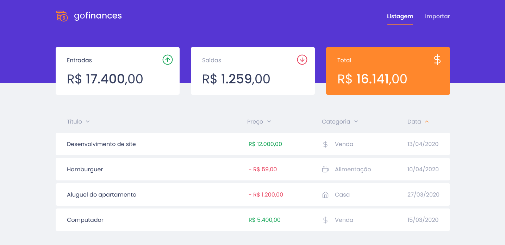
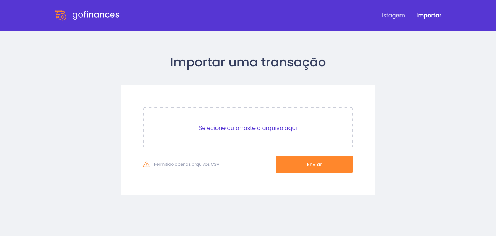
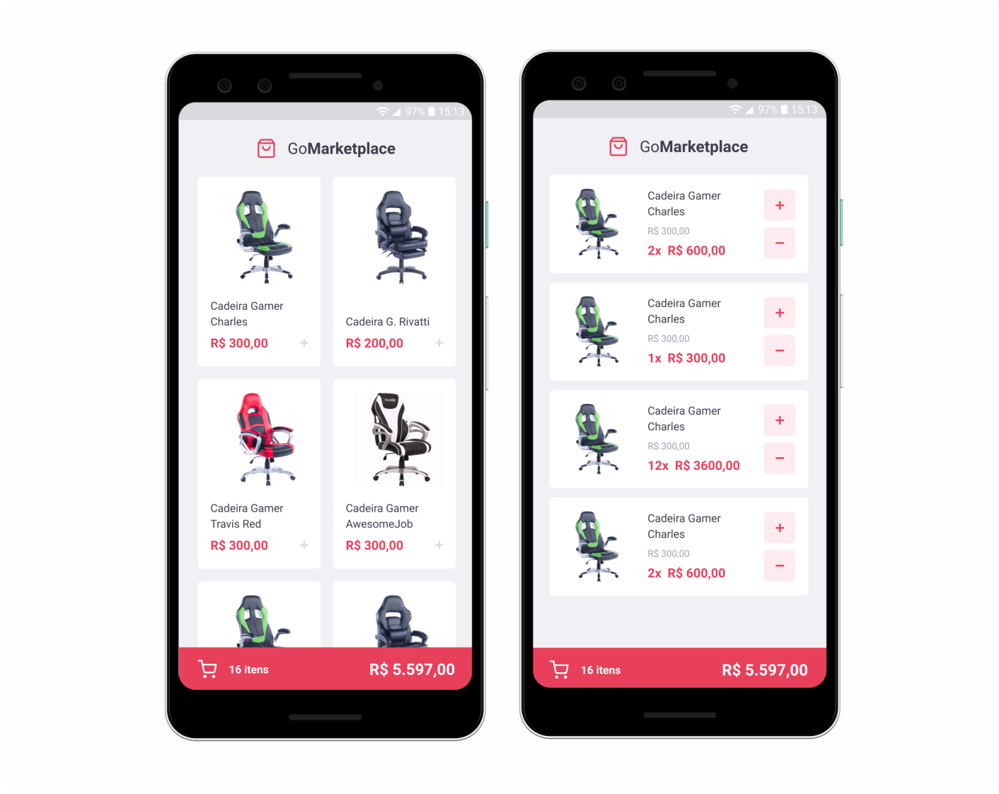
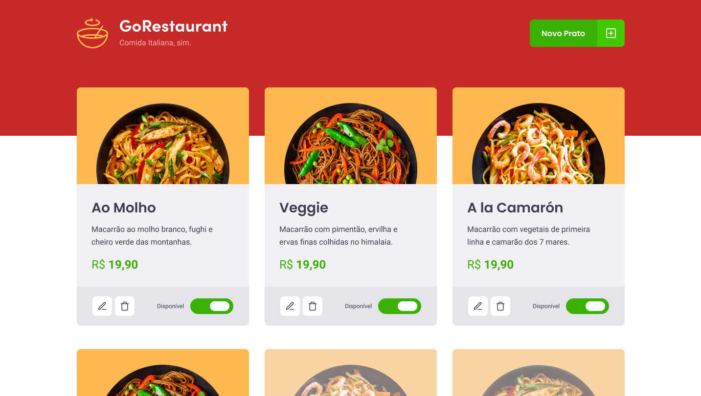
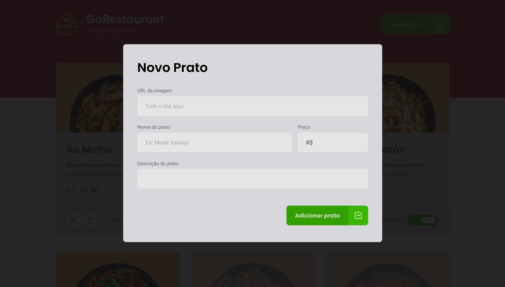
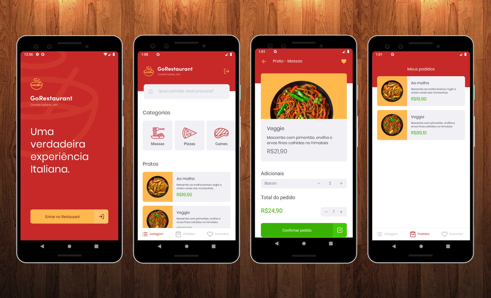

## Índice de desafios cumpridos ✅

- [Conceitos do Node.js](https://github.com/Igorryan/rocketseat-gostack/tree/master/conceitos-nodejs)
- [Conceitos do ReactJS](https://github.com/Igorryan/rocketseat-gostack/tree/master/conceitos-reactjs)
- [Conceitos do React Native](https://github.com/Igorryan/rocketseat-gostack/tree/master/conceitos-react-native)
- [Fundamentos do Node.js](https://github.com/Igorryan/rocketseat-gostack/tree/master/fundamentos-node-typescript)
- [Banco de dados e upload de arquivos no Node.js](https://github.com/Igorryan/rocketseat-gostack/tree/master/desafio-database-upload)
- [Fundamentos do ReactJS](https://github.com/Igorryan/rocketseat-gostack/tree/master/fundamentos-reactjs)
- [Fundamentos do React Native](https://github.com/Igorryan/rocketseat-gostack/tree/master/fundamentos-react-native)
- [Relacionamentos com banco de dados no Node.js](https://github.com/Igorryan/rocketseat-gostack/tree/master/desafio-typeorm-relations)
- [CRUD no ReactJS](https://github.com/Igorryan/rocketseat-gostack/tree/master/desafio-reactjs-crud)
- [Navegação e filtros no React Native](https://github.com/Igorryan/rocketseat-gostack/tree/master/react-native-delivery).

### Banco de dados e upload de arquivos no Node.js

Neste desafio, continuei a desenvolver a aplicação de gestão de transações, praticando Node.js junto ao TypeScript e incluindo o uso de banco de dados com o TypeORM e envio de arquivos com o Multer!

### Fundamentos do React Native
Neste desafio, desenvolvi a GoMarketplace para praticar React Native junto com o TypeScript, utilizando rotas, Async Storage e Context API.

### CRUD no ReactJS
Neste desafio, desenvolvi o GoRestaurant para praticar React.js junto com o TypeScript, aplicando o conceito de CRUD (Create, Read, Update, Delete). 

### Navegação e filtros no React Native
Nesse desafio, desenvolvi o GoRestaurante, só que dessa vez a versão mobile para o cliente. Para praticar React Native junto com Typescript.

  Feito com ❤︎ por <a href="https://www.linkedin.com/in/igorryan/">Igor Ryan</a>

